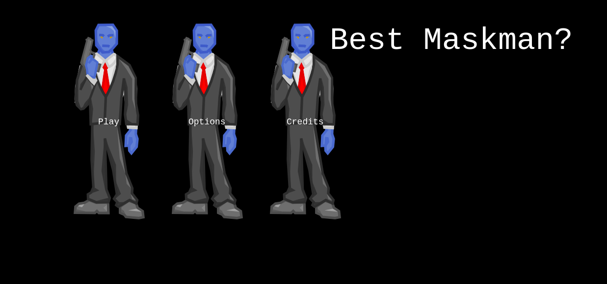

# Best Maskman Game

> This project is a capstone project required by Microverse, after completing the javascript curriculum. This game is built with JS ES6 and Phaser3.

## Features

1. The player can navigate to the following scenes after the game loads
`Credits`: This is where we give credits to the Microverse team, opengameart, and the creator of the game.
`Options`: We can toggle the background music on/off.
`Play`: We navigate the guide scene and understand how to play the game before proceeding.
2. A player can fire a laser to kill the enemy attacking.
3. The enemy can also fire laser and kill the player.
3. After the game is over or the stage is completed, the player has the option to `restart` game/`submit` score.

## Future Feature (v2.02)

1. Improve the UI
2. Add more levels to the game
3. Each level should have a more attacking enemy

## Design Process (GDD)

At the end of day 2, I have learned the basics of Phaser3. Setting up and creating scenes, adding objects to the scenes, adding collision
and assets to the scenes.
The rest of the days are for the following:
- Implement the logic behind the game.
- Implement the service API to record and show user name and score.
- Implement test for our Model and API

## Screenshots

## Built With

- Javascript ES6
- Phaser3
- Babel
- Webpack

## Live Demo

[Live Demo Link](https://addod19.github.io/js_game_capstone/)

## Video Presentation

[presentation](https://www.loom.com/share/b6e85873de1949d09f663ad1b394cfc0)

## Getting Started

To get a local copy up and running follow these simple example steps.

1. `git clone https://github.com/addod19/js_game_capstone.git`
2. `cd js_game_capstone`
3. `git checkout shoot`
4. `npm i`
5. `npm start`
6. `npm run build`
7. Use live server on VSCode to open the index.html with your favorite browser

### Prerequisites

- [Node.js](https://nodejs.org) is required to install dependencies and run scripts via `npm`.
- A modern browser

## Available Commands

| Command | Description |
|---------|-------------|
| `npm install` | Install project dependencies |
| `npm start` | Build project and open web server running project |
| `npm run build` | Builds code bundle with production settings (minification, uglification, etc..) |

## Authors

👤 **Daniel Larbi Addo**

- Github: [@addod19](https://github.com/addod19)
- Twitter: [@DanielLarbiAdd1](https://twitter.com/DanielLarbiAdd1)
- Linkedin: [Daniel Larbi Addo](https://linkedin.com/in/daniel-larbi-addo/)
- Email: [Daniel Larbi Addo](addodaniellarbi@gmail.com)

## 🤝 Contributing

Contributions, issues and feature requests are welcome!

Feel free to check the [issues page](https://github.com/addod19/weather-app/issues).

1. Fork it (https://github.com/addod19/js_game_capstone/fork)
2. Create your feature branch (git checkout -b my-new-feature)
3. Commit your changes (git commit -am 'Add some feature')
4. Push to the branch (git push origin my-new-feature)
5. Create a new Pull Request

## Show your support

Give us a ⭐️ if you like this project!

## Acknowledgments
- Microverse
- Developers at Open Game Art; Marcus Rasseli, Binngi, Aljazk, Sogomn, Redshrike, Qubodup for the characters, sprites, laser, sound, background music etc
                  
